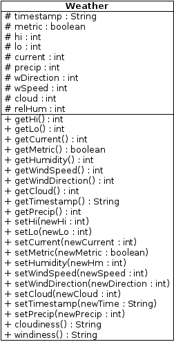

#XML parsing using SAX
The objective is for this class to take some XML and return a list of weather objects.

##weather class
* the weather class has a bunch of attributes to store weather data in
* use a weather object per day (?)
* cloudiness returns a string of how cloudy it is, like "partly cloudy", or "sunny"
* windiness returns a string of the wind speed and direction, like "5KN NE" or "18M/S S"

##Actual parsing
[java SAX docs](https://docs.oracle.com/javase/7/docs/api/org/xml/sax/packagesummary.html)

* when the document begins, instantiate an arrayList
* when each element beings, take note of what it is and when it is and store it in the appropriate part of the appropriate weather object

*
